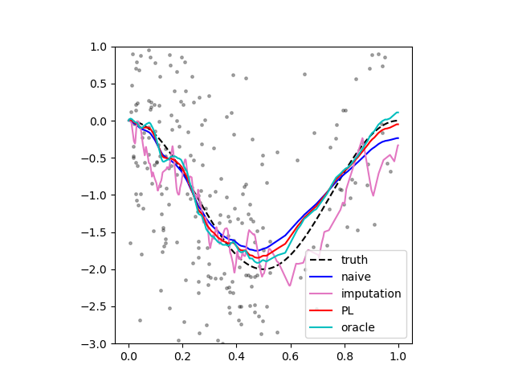

# Pseudo-Labeling for Kernel Ridge Regression under Covariate Shift

Paper: (https://arxiv.org/abs/2302.10160).


## Demonstration

See `demo.ipynb` for the simulation experiment in Section 1. 
- Feature space: $[0, 1]$.
- Response model: $y|x \sim N( f^\*(x) , \sigma^2 )$ with $f^\* (x) = \cos(2\pi x) - 1$ and $\sigma = 1$.
- Source covariate distribution: $\frac{B}{B + 1} \mathcal{U} [0, 1/2] + \frac{1}{B + 1} \mathcal{U} [1/2, 1]$ with $B = 5$.
- Target covariate distribution: $\frac{1}{B + 1} \mathcal{U} [0, 1/2] + \frac{B}{B + 1} \mathcal{U} [1/2, 1]$ with $B = 5$.
- Samples sizes: 500 (source, labeled) and 500 (target, unlabeled).
- Kernel: first-order Sobolev kernel $K(z, w) = \min \lbrace z , w \rbrace $.

We run kernel ridge regression on half of the source data with different penalty parameters to get a collection of candidate models. Then, we compare model selection methods based on different validation datasets.
- Proposed method (red): target data with pseudo-labels;
- Oracle method (cyan): target data with noiseless responses;
- Naive method (blue): the held-out half of source data.
  
We also visualize the imputation model for pseudo-label generation (pink).

<p align="center">
    
</p>


## The experiment in Section 5.2

To reproduce the numerical results in Section 5.2, please refer to `experiment.ipynb`. The outcomes are stored in the compressed folder named `results.zip`. See `summary.ipynb` for statistical analysis and visualization.


## Citation
```
@article{wang2023,
  title={Pseudo-Labeling for Kernel Ridge Regression under Covariate Shift},
  author={Wang, Kaizheng},
  journal={arXiv preprint arXiv:2302.10160},
  year={2023}
}
```
